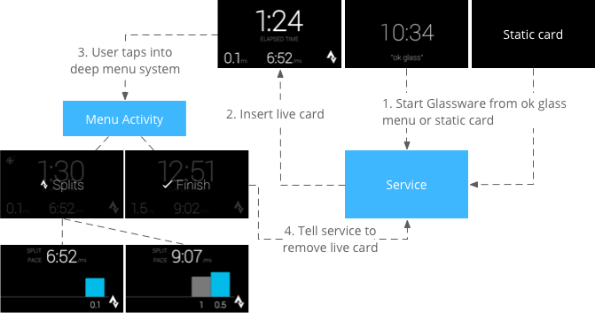
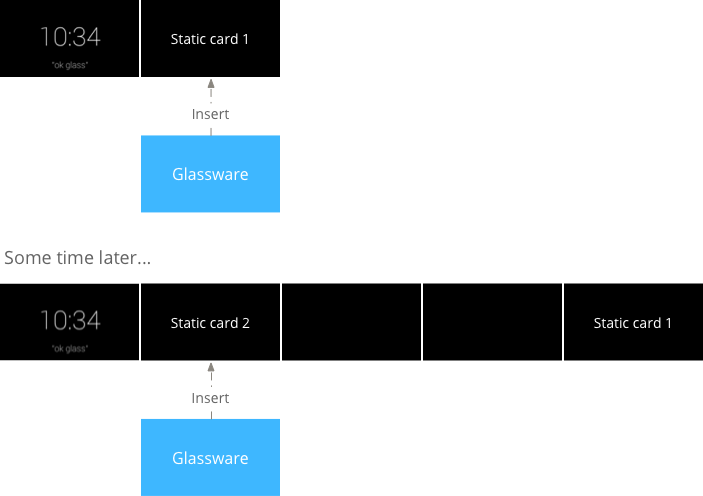

# Patterns

Use common UX patterns to give users a consistent experience across all Glassware.

Here you'll learn about the basic building blocks to build these patterns along with examples of patterns that we feel work great on Glass.

## Pattern building blocks

By using the major UI elements along with an invocation method, you can build a wide variety of usage patterns that work well on Glass. You can then combine multiple patterns together in your Glassware for the use cases that you require.

**UI elements**

1.  Static card - Displays text, HTML, images, and video. Static cards can invoke live cards or immersions.
2.  Live card - Displays cards that are important at the current moment, usually rendered at a high frequency.
3.  Immersion - Displays Android activities that take over the timeline experience.

**Invocation methods**

1.  **ok glass** touch or voice menu
2.  Contextual voice or touch menu on a timeline card

### Voice invocation model

Voice commands are a major part of user interaction with Glass and allow users to do things hands-free, quickly, and naturally. How a voice command starts the interaction with users is an integral part of the Glassware experience.

We carefully select voice commands to include on the **ok glass** menu based on a set of criteria. See the [voice command checklist](https://developers.google.com/glass/distribute/voice-checklist) for complete details about what we look for in a good voice command. In general, voice commands adhere to the following guidelines on Glass.

**Focus on the action, not the agent**

Voice commands should be based on what users want to do and not what Glassware is carrying out the action.

For instance "ok glass, take a picture" is preferred over "ok glass, start camera." Focusing on the action is a more natural way for user interaction and all of the main voice commands follow this guideline.

**Decrease time from intent to action**

Voice commands should carry out the action as quickly as possible.

For instance, "ok glass, listen to Led Zeppelin" starts playing music by default and doesn't force users to select options before playing.

**Is colloquial and easy to say**

Voice commands are natural sounding, are different enough from existing commands, and are at least two words. This lets us tune our voice recognition to work well with a wide variety of commands.

**Is general enough to apply to multiple Glassware**

To avoid clutter on the **ok glass** voice and touch menus, voice commands should work for multiple Glassware if necessary. In these situations, Glass automatically shows a menu with the names of the Glassware that can carry out the command.

For instance, "ok glass, play a game, spellista" is preferred over "ok glass, play spellista."

## Patterns

### Ongoing task

Ongoing tasks are long-running live cards that users leave and come back to frequently.

For example, the Stopwatch sample that is shipped with the GDK starts the stopwatch with an **ok glass** command.

Users can view the stopwatch for some time, navigate through the timeline to check other cards, and come back to the stopwatch. If the display sleeps, the stopwatch is the default card that displays when the display wakes up (as long as it had focus when the display went to sleep). Users can stop the stopwatch by tapping on a **Stop** menu item.

> **Note:** All live cards must have a **Stop** menu item (or similar) to dismiss the card.

Another example of an ongoing task is Strava. Strava inserts a live card that contains a timer for a current run or bike ride. Tapping on the live card reveals menus to carry out a wide array of options. A finish menu item removes the live card from the timeline when users are finished with their run or bike ride.

### Immersion

This pattern describes displaying immersions in the form of Android activities. Immersions take over the timeline experience momentarily and users return back to the timeline by swiping down.

### Periodic notifications

This pattern describes inserting static cards in the timeline without an invocation model. Your service delivers notifications based on settings that the user defines. For example, delivering top news stories every hour or emails as they are received.

Notifications leverage Mirror API web services or Android background services on Glass to push notifications to the timeline.

