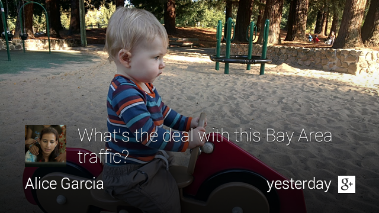
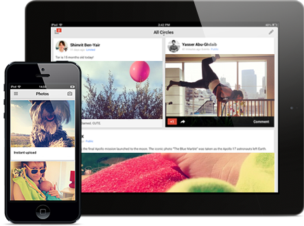
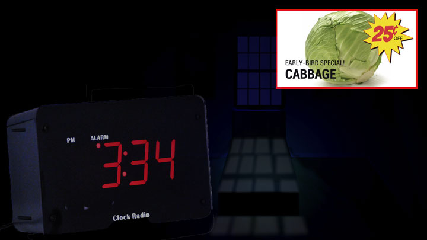

# Principles

Glass is fundamentally different than existing mobile platforms in both design and use. Follow these principles when building Glassware to give users the best experience.

## Design for Glass

Users typically have multiple devices that store and display information for specific time periods. Glass works best with information that is simple, relevant, and current.

Don't try to replace a smartphone, tablet, or laptop by transferring features designed for these devices to Glass. Instead, focus on how Glass and your services complement each other, and deliver an experience that is unique.

**Figure 1**: Google+ on Glass shows a single card for each post, with a simple layout and most content behind a **Read more** menu item.

**Figure 2**: Google+ on phones and tablets shows a full stream of post with content inline.

## Don't get in the way

Glass is designed to be there when you need it and out of the way when you don't. Your Glassware must function in the same way. Offer engaging functionality that supplements the user's life without taking away from it.

**Figure 3**: The Glass display rests just above your natural line of sight, allowing people to experience the world and access Glass when they need to. Google Search lets you find specific information in context.

## Keep it relevant

Deliver information at the right place and time for each of your users. The most relevant experiences are also the most magical and lead to increased engagement and satisfaction.

**Figure 4**: Delivering a shopping list when users arrive at their favorite grocery store is an experience that is relevant and works well on Glass.

## Avoid the Unexpected
Unexpected functionality and bad experiences on Glass are much worse than on other devices, because Glass is so close to your users' senses.

Don't send content too frequently and at unexpected times. Always make it clear to users what the intention of your Glassware is and never pretend to be something you're not.

**Figure 5**: Sending notifications when users don't want to see them is a bad experience. Be aware of time, frequency, and location when you are delivering information.

## Build for people
Design interfaces that use imagery, colloquial voice interactions, and natural gestures.

Focus on a fire-and-forget usage model where users can start actions quickly and continue with what they're doing.

**Figure 6**: Messaging on Glass prioritizes images of people, lets you reply by speaking naturally, and sends automatically when you stop talking.