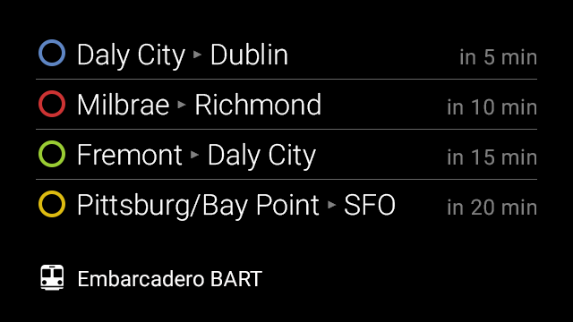
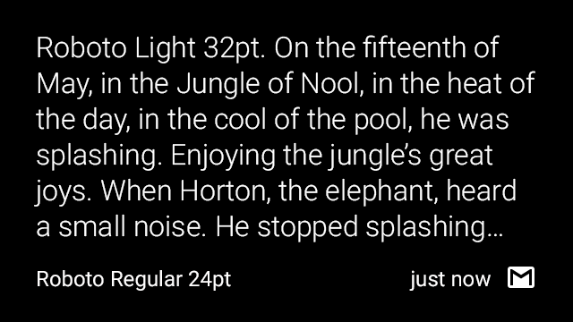
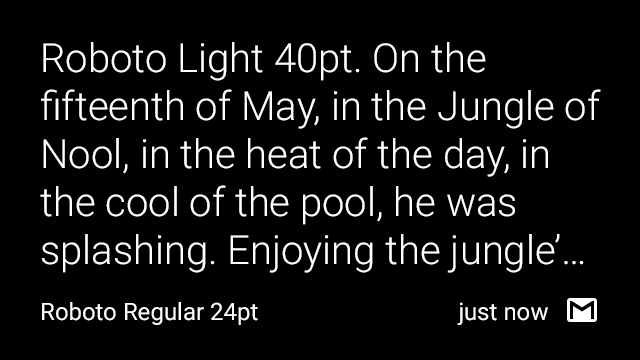
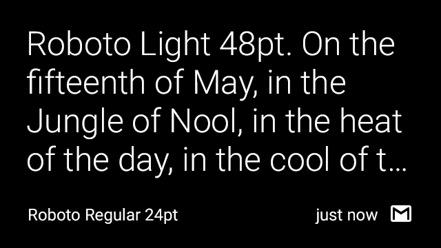
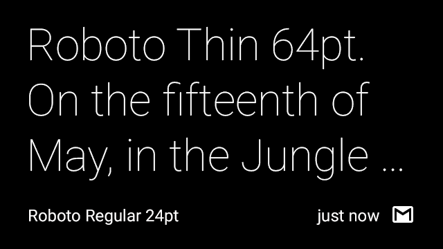

# Style

Glass has a unique style, so we provide standard card templates, a color pallete, typography, and writing guidelines for you to follow whenever possible.

Before designing any custom layouts, use the available [CardBuilder Layouts](https://developers.google.com/glass/develop/gdk/card-design#layouts) [**TODO**: ADD LINK] provided by the GDK to give users a consistent user experience. If none of these layouts meet your requirements, follow the guidelines below in your design.

## Metrics and Grids

The Glass user interface has standard layout and margin guidelines for different types of timeline cards. Cards normally have the following general regions, and we've laid out some guidelines for you to follow for a general set of cards.

### Card regions

Glass defines dimensions for a set of common regions to make it easy to design and display different cards consistently.

Main Content
The main text content of the card is in Roboto Light with a minimum size of 32 pixels and is bounded by padding. Text that is 64 pixels and larger uses Roboto Thin.

Footer
The footer shows supplementary information about the card, such as the source of the card or a timestamp. Footer text is 24 pixels, Roboto Regular, and white (#ffffff) in color.

Full-bleed image
Images work best when full-bleed and do not require the 40px of padding that text requires.

Left image or column
Left image or columns require modifications to padding and text content.

Padding
Timeline cards have 40 pixels of padding on all sides for the text content. This allows most people to see your content clearly.

## Layout templates

The GDK provides various [CardBuilder Layouts](https://developers.google.com/glass/develop/gdk/card-design#layouts) [**TODO**: ADD LINK] that you can use.

## Color

Glass displays most text in white and uses the following standard colors to denote urgency or importance. You can make use of these colors for your timeline cards as well:

| CSS Class | RGB Value |
| --------- | --------- |
| white      | \#ffffff  |
| gray       | \#808080  |
| blue       | \#34a7ff  |
| red        | \#cc3333  |
| green      | \#99cc33  |
| yellow     | \#ddbb11  |

> **Note**: if you apply these CSS styles to your HTML timeline cards, Glass renders them automatically with the correct color. Glass uses the [base_style.css](./static/base_style.css) file to render HTML cards.

The following example uses colors to denote important information about train lines and status.

## Typography

Glass displays all system text in Roboto Light, Roboto Regular, or Roboto Thin depending on font size. If you're creating live cards or immersions, feel free to use different typography to convey your own branding.

### Roboto Light

Glass displays most text in this font.

> **Editor's note:** this is not actually Roboto Light. If for some reason you happen to want it very badly, [submit a pull request](https://github.com/glasskit/website/pulls).

ABCDEFGHIJKLMN OPQRSTUVWXYZa bcdefghijklmnopqrstuvwxyz1234567 890!?/+-=()[]#@$
 
%^&\*&lt;&gt;:;”

&gt;

### Roboto Regular

Glass displays footnote text in this font.

> **Editor's note:** this is not actually Roboto *Regular*. Hopefully you see the pattern.

ABCDEFGHIJKLMN OPQRSTUVWXYZa bcdefghijklmnopqrstuvwxyz1234567 890!?/+-=()[]#@$%^&\*&lt;&gt;:;”

### Roboto Thin

Glass displays larger text (64 px and above) in this font.

> **Editor's note:** ...

ABCDEFGHIJKLMN OPQRSTUVWXYZa bcdefghijklmnopqrstuvwxyz1234567 890!?/+-=()[]#@$%^&\*&lt;&gt;:;”

> **Editor's note:** I'm very sorry about the size of the text, and if it breaks the site. This is *actually how it showed up on the original site*. Don't believe me? [Check it out](./static/old-site-fonts.png)

### Dynamic text resizing

When using the [`CardBuilder.TEXT`](https://developers.google.com/glass/develop/gdk/card-design#text_and_text_fixed) [**TODO**: ADD LINK] and [`CardBuilder.COLUMNS`](https://developers.google.com/glass/develop/gdk/card-design#columns_and_columns_fixed) [**TODO**: ADD LINK] layouts, Glass uses the largest font size possible based on the amount of content. The following cards show examples of the typography characteristics of text based on the amount of text.

## Writing

You have limited space for text, so follow these guidelines when writing text for Glassware.

**Keep it brief**. Be concise, simple and precise. Look for alternatives to long text such as reading the content aloud, showing images or video, or removing features.

**Keep it simple**. Pretend you're speaking to someone who's smart and competent, but doesn't know technical jargon and may not speak English very well. Use short words, active verbs, and common nouns.

**Be friendly**. Use contractions. Talk directly to the reader using second person ("you"). If your text doesn't read the way you'd say it in casual conversation, it's probably not the way you should write it.

**Put the most important thing first**. The first two words (around 11 characters, including spaces) should include at least a taste of the most important information in the string. If they don't, start over. Describe only what's necessary, and no more. Don't try to explain subtle differences. They will be lost on most users.

**Avoid repetition**. If a significant term gets repeated within a screen or block of text, find a way to use it just once.