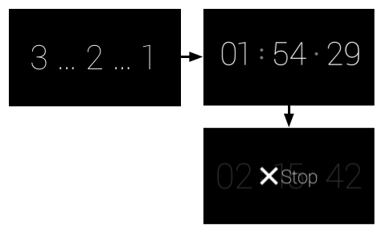
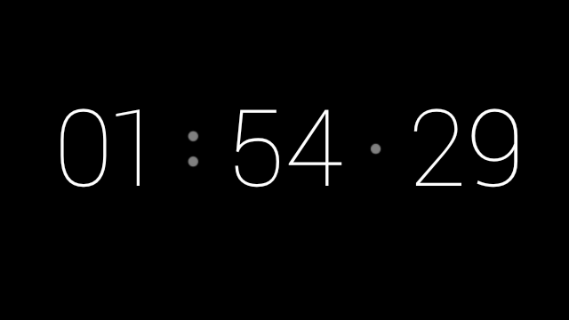
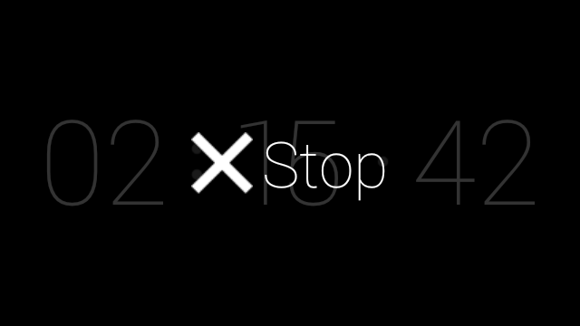

# Ongoing Task Pattern

This guide describes the components that comprise an ongoing task in the form of a Stopwatch. An ongoing task displays a live card in the timeline for as long as a user is engaged in a task and allows them to jump in and out of the live card as they need information.

Along the way, you'll also learn design, development, and distribution tips that are important to building your own Glassware.

## Before you begin

The full source of the Stopwatch is available on Github. Import it into Android Studio before you begin, because this guide refers to it heavily.

1.  From the Quick Start screen click **Check out from version Control > Git**.
2.  Copy the clone URL from [Stopwatch](https://github.com/googleglass/gdk-stopwatch-sample). [**TODO**: SWITCH LINK]
3.  Paste the clone URL into the **Vcs Repository URL** and click **Clone**.
4.  Click **Yes** on the following screen.
5.  Click **OK** on the following screen.
6.  Build the project and run it on your connected Glass by clicking on the **Play** button. Make sure to check the sample's `README` for invocation details.

## What you'll learn

You'll learn how to use components from the Android SDK to build the bulk of the Stopwatch ongoing task and then the GDK to hook into the Glass experience. Here's a list of topics that you'll learn about:

-   Building a custom view to draw to the live card
-   Creating a service to manage the live card
-   Providing a menu that lets users remove the live card from the timeline
-   Declaring a voice trigger to start the stopwatch from the main voice menu

## Design

Before you start developing, take some time and design your Glassware. Doing this gives you a good idea of what UI flows work best on Glass, what voice command you'll use, and how your cards will look.

Of course, designing Glassware is an iterative process and some of the things that you design now will change, but having a good portion of this work done in the beginning is crucial to building a great experience.

### UI flow

Designing the UI flow is a simple exercise and lets you visualize your Glassware before writing a line of code. We do it all the time for the Glassware that we build!

Let's go over the major UI elements of the Stopwatch, so you get an idea of how the UI works and how helpful this process can be when creating your own Glassware.

### Main UI

The Stopwatch contains only one main flow, because it's a fairly simple experience.

When users invoke the Glassware, they are presented with a 3-second countdown interstitial before the actual stopwatch begins. The stopwatch then counts up until the user removes it from the timeline with a **Stop** menu item.

> **Development Tip**
>
> Create a **Stop** menu item (or similar) for all live cards to remove the live card from the timeline.

### Voice command

You should figure out a voice command fairly early in the design process. Voice commands let users start Glassware from the Glass Home (clock card) voice menu, if needed, and is a major part of how you design Glassware.

For example, the **Post an update** command works well in a fire-and-forget model, where users speak text and the Glassware processes it without any further user intervention. This lets users get back to what they're doing quickly.

On the other hand, for something like **Play a game**, you'll usually want to land users on a splash screen so that they can get oriented first. Because this voice command most likely launches an immersion, you can expect users to be okay with seeing extra screens and menus to start the game. Immediately throwing users into a gaming experience right after the voice command is typically a bad experience for games.

The Stopwatch uses the **Start a stopwatch** voice command. After users invoke the voice command, the Stopwatch immediately starts after a short, interstitial countdown screen, which is better than providing a menu item to start. For ongoing tasks, you'll generally want to focus on getting users to the experience as quick as possible, where it makes sense.

> **Note**: Glass automatically adds a touch command (shown with your Glassware icon) to the main menu if users choose to tap instead of speak the voice command.

### Card layouts

Whether you're building immersions or live cards, you should use the [`CardBuilder`](https://developers.google.com/glass/develop/gdk/card-design#glass-styled_cards) [**TODO**: SWITCH LINK] or [XML layouts](https://developers.google.com/glass/develop/gdk/card-design#xml_layouts) [**TODO**: SWITCH LINK] when possible.

Oftentimes, you'll still need to build your own layout so follow our [UI guidelines](../../design/style.md#metrics_and_grids) to have the best looking Glassware.

The Stopwatch follows the general layout guidelines, but has custom UI layouts using standard Android components like views and layouts.

> **Designing Tip**:
> 
> The Mirror API Playground (not available) is a useful tool for mocking GDK cards. You can use one of the templates as a starting point, edit the HTML for the card, and see changes in real time.
> 
> You can then use the mock as a reference to create your custom XML layouts in Android.

## Develop

To develop live cards, you use the same tools you'd use for Android development to build the bulk of the Glassware and then use the APIs in the GDK add-on to access Glass-specific functionality, such as live cards and voice commands.

You'll frequently use common Android components to create Glassware, but keep in mind that some concepts are sometimes different. For example, you render and manage live cards with an Android service, which is not a typical way you use services in traditional Android apps. Another example is live cards do not own their own UI context, so you have to use a shell activity that displays a menu for the live card. You'll learn how these components are built later on in this guide.

The rest of the Develop sections go over how the Stopwatch is structured and the major components of the project that you imported earlier. It's useful to have Android Studio up now so that you can follow along. The source code itself is commented, so this section goes over the high-level purpose of each file and helpful tips that you can apply to your own Glassware.

### Voice command

You create voice commands with an XML resource file that specifies the command you're using and then by specifying the XML resource in the `AndroidManifest.xml` file.

The following files are associated with the Stopwatch voice command:

-   `res/xml/voice_trigger_start.xml` - Declares the voice command to use.
-   `AndroidManifest.xml` - Declares the live card service to start when the voice command is spoken.

> **Development Tip**:
> 
> Check out the list of [existing commands](https://developers.google.com/glass/develop/gdk/reference/com/google/android/glass/app/VoiceTriggers.Command) [**TODO**: SWITCH LINK].
> 
> For development purposes, you can declare any voice command you want by using [voice development mode](https://developers.google.com/glass/develop/gdk/starting-glassware#unlisted_commands) [**TODO**: SWITCH LINK].

### Countdown view

The Stopwatch shows a countdown before the time is actually recorded to give users notice that time is about to elapse.

The following files are associated with the countdown view:

-   `res/layout/card_countdown.xml` - Defines the layout for the countdown viewer
-   `src/com/google/android/glass/sample/stopwatch/CountDownView.java` [**TODO**: SWITCH LINK] - Defines the view for the countdown.

### Chronometer view

This is the main view of the Stopwatch. It displays the elapsed time since the countdown interstitial completes. The following files are associated with the chronometer view:

-   `res/layout/card_chronometer.xml` - Defines the layout for the stopwatch view
-   `src/com/google/android/glass/sample/stopwatch/ChronometerDrawer.java` - Defines how to render the view. The live card service calls this class to draw to the live card service.
-   `src/com/google/android/glass/sample/stopwatch/ChronometerView.java` - The stopwatch view that uses the previous layout as it's UI.

### Stopwatch service

This is the service that manages the live card's lifecycle and rendering. The following files are associated with this service:

-   `src/com/google/android/glass/sample/stopwatch/StopwatchService.java` - Manages the stopwatch live card and handles the service lifecycle.

### Menu Activity

Live cards do not have their own UI context to display a menu in because they render their UIs in the context of the timeline.

To get around this limitation, you create a translucent activity that appears on top of the timeline and then display that activity's menu immediately after users tap on the live card.

> **Distributing Tip**:
> 
> All menu items must have a corresponding 50 × 50 white-on-transparent icon associated with them. This is required to launch on MyGlass.
> 
> In addition, all live cards must have a **Stop** menu item that lets users remove the live card from the timeline.
> 
> We provide [standard icons](./static/menu_icons.zip) you can use if they work for you.

-   `src/com/google/android/glass/sample/stopwatch/MenuActivity.java` - Declares the translucent menu activity that immediately shows the menu when the activity is visible.
-   `res/values/styles.xml` - Defines the translucent style that is applied to the menu.
-   `res/menu/stopwatch.xml` - The menu resource that contains the mandatory **Stop** menu item.

## Android Manifest

The `AndroidManifest.xml` file describes the major components of your Glassware so the system knows how to run it. The manifest for Charades declares the following things:

-   The Glassware's icon and name. Glass displays this information on the main touch menu if more than one Glassware responds to the same voice command.
-   All of the services and activities associated with the Stopwatch. This is required for the system to know how to start your Glassware's components.
-   The voice command and an intent filter that starts the live card service when the voice command is spoken.
-   A version code for the Glassware. This code must be updated (and typically the version name as well) every time a new version of this APK is uploaded to MyGlass.