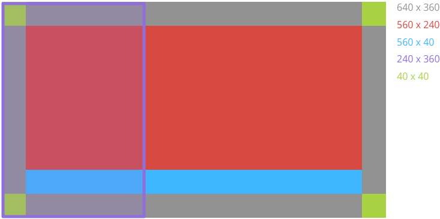
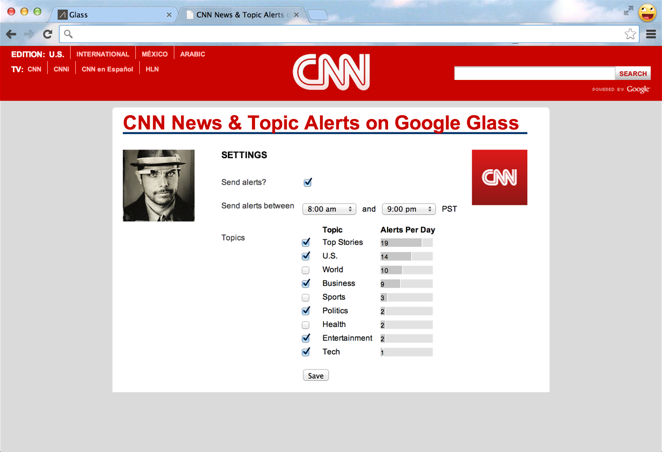

# Glassware Guidelines

These guidelines will help you avoid common pitfalls and guide you through the process of building a high-quality Glassware.

> **Note**: If a guideline item has GDK or Mirror API in the title, then you do not have to check that item if you're not using that particular API.

## Invocation

### I1. Use voice commands correctly

-   Ensure your Glassware uses [approved voice commands](https://developers.google.com/glass/develop/gdk/reference/com/google/android/glass/app/VoiceTriggers.Command) [**TODO**: ADD LINK].
-   Ensure your Glassware uses [approved contextual commands](https://developers.google.com/glass/develop/gdk/reference/com/google/android/glass/app/ContextualMenus.Command) [**TODO**: ADD LINK].
-   The Mirror API is not designed to receive requests from users and respond in real-time or with low latency. If this is a requirement, use the GDK. For example, Mirror API Glassware works well with the "take a note" or "post an update" command, because users do not have to wait for a response from the Glassware after invoking the command.
-   In contrast, "start a timer" and "tune an instrument" don't work well with Mirror API Glassware, because users expect the experience to start immediately.

### I2. Don't use a pinned Mirror API timeline item as a launcher

The two main ways for users to invoke Glassware and its features are by using a voice or touch command from the **ok glass** main menu or through a contextual menu from a timeline card.

You should never force users to pin a timeline card with menu items for the purpose launching Glassware. The Mirror API is designed for [periodic notifications](../design/patterns#periodic_notifications) based on user-configured settings or to [share content with contacts](https://developers.google.com/glass/develop/mirror/contacts) [**TODO**: ADD LINKS].

Providing menu items to launch GDK Glassware or call the Mirror API is okay as long as the experience is consistent with the [periodic notifications](../design/patterns#periodic_notifications) design pattern and does not use the [Mirror API for immediate interactivity](https://developers.google.com/glass/distribute/best-practices#dont_use_the_mirror_api_for_immediate_interactivity) [**TODO**: ADD LINK].

For example, a pet adoption Glassware shouldn't insert a timeline card and force users to pin it to access features later on (for example, to "Search for dogs", "Search for cats", "Search for birds", and so on). Instead, the Glassware should allow users to set criteria for the pets they want and periodically deliver cards that meet this criteria. These cards can then contain menu items to carry out actions such as "Read bio" and "Adopt pet".

### I3. Invoking GDK Glassware from Glass home starts a live card or immersion

It must be clear to users that Glassware is running if they explicitly invoke it.

## Design

### D3. Don't use the GDK to port mobile features that work poorly on Glass

Glass is designed for small pieces of information that's delivered at the right time. Porting every feature from a mobile app will not work well on Glass. Instead find the main use cases that work well on Glass and focus on delivering a few magical features. See [Design for Glass](../design/principles#design_for_glass) for inspiration.

### D4. Use the GDK to innovate new features, but be consistent with the Glass system when appropriate

-   Taps on live cards always bring up a Glass menu. All live cards must have a **Stop** menu item to dismiss the live card from the timeline.
-   If live cards start immersions, users are brought to where they previously left off in the immersion, where it makes sense.
-   Swiping or tapping in immersions always produce an action or feedback that the gesture was not consumed (for example, use [horizontal tugging](../develop/gdk/card-scroller#horizontal_tugging_feedback)).
-   Gestures that don't behave like the Glass system should have clear instructions on how to use them and clear results.
-   If you create UI elements that are similar to what the Glass system provides, use what the Glass system provides instead. For instance, use a [card scroll view](../develop/gdk/card-scroller#scrolling_cards_in_activities) instead of implementing your own.
-   Use immersions for focused tasks that require it. Otherwise, other options such as a live card or static cards are preferred.

### D6. Follow standard card design and templates

When possible, use approved [card designs](../design/style#layout_templates). [Mirror API](https://developers.google.com/glass/tools-downloads/playground) [**TODO**: ADD LINK] and [GDK](../develop/gdk/card-design#xml_layouts) templates are available for some of these designs.

-   Use the styles in [base_style.css](../design/static/base_style.css) if you are using the Mirror API.
-   Follow the [general rules](../design/style#card_regions) for padding and spacing as the built-in templates.

### D7. Bundle and paginate cards properly

Bundles and pagination allow you to group together cards, but you should use them correctly in the following situations.

> **Note**: Bundling and paginating features are built into the Mirror API. If you are trying to achieve the same functionality in the GDK, mimic how the Mirror API presents bundling and pagination as close as possible. Use [stack indicators](../develop/gdk/card-design#stack_indicator), [menu items](../develop/gdk/immersions#creating_and_displaying_a_menu), and [card scrollers](../develop/gdk/card-scroller#scrolling_cards_in_activities) to present your cards.

### Bundles

-   Use bundles for groups of cards that are similar but shouldn't be on the same card.
-   Design bundle cover cards to be digests that are visually different from the cards the bundle contains.
-   Notify the user with a notification sound only once for each bundle.

Cases where bundles work well:

-   A thread of emails or short messages
-   Three SMS messages between the same people
-   Five photos taken within an hour of each other
-   Related articles inserted all at once
-   A list of key events and score updates for an ongoing sports game

Cases where bundles don't work well:

-   All content from your service
-   Many headlines sent to Glass over the course of a day

### Pagination

Use pagination for timeline items that do not fit on a single card because of space constraints, but otherwise should be on the same card.

Cases where pagination work well:
-   A single email, news story, or similar content that doesn't fit on one card

Cases where pagination doesn't work well:
-   A group of distinct cards, such as multiple news stories or emails

### D8. Follow best practices

Ensure your Glassware adheres to the rest of our Glassware [best practices](./best-practices#create_content_appropriately).

## Web properties

### WP1. Highlight Glass-specific features on your website
-   Use the [Send to Glass](../send-to-glass-buttons.zip) icons if sending content to Glass from the web.
-   Use the [Get it on Glass](../get-it-on-glass-buttons.zip) icons if providing a link to download Glassware.
-   Ensure correct grammar and spelling.

### WP2. Provide easy authorization flows
-   Do not have more than two authorization or login pages.
-   Settings should not require re-authorization within a reasonable span of time (less than three months).
-   If an account or a companion app is required, the authorization flow is clear for users who have or don't have an account with your service.
-   The URL to the authorization web page must be different from the URL for the settings web page.
-   If a user account is required, Glassware must not authenticate a user without connecting to the user account.

### WP3. Provide clear and useful settings
-   Indicate visually that a settings change is saved.
-   Indicate update frequency overall and per feed if applicable to [keep your content relevant](../design/principles#keep_it_relevant). The following screenshot shows an example of allowing users to set update frequency and feed types.

## Branding

### B1. Use proprietary Glass assets correctly

The Glass brand and its associated assets are proprietary and are carefully designed and used by Google.

-   Do not use, modify, or mimic proprietary Glass logos or assets in any way unless they are provided on the [Assets](/glass/tools-downloads/downloads) page.
-   Do not use, modify, or mimic the Glass logo font for use in your product.

## Writing

### W1. Glassware and its description are in English

Glassware and its related descriptions must be in English by default. Multiple languages are okay if there is complete feature parity between languages.

### W2. Name your Glassware appropriately

Ensure your Glassware name accurately portrays the Glassware's functionality or branding. Do not use the string "Glass" in the name, unless it is in the phrase "for Glass." For example, "Cat Facts for Glass" is okay, but not "Glass Cat Facts" or "Glassy Cat Photos."

### W3. Use Glass terms correctly

See the [Glass in text](../branding-guidelines#glass_in_text) section for restrictions and guidelines.

### W5. Use Glass voice

Follow [guidelines](../design/style#writing) for writing when applicable.

## Testing

### T1. Test on actual hardware

Run your Glassware on actual Glass hardware. This is the only way to accurately gauge the user experience. Also ensure that GDK Glassware does not cause unexpected performance, such as overheating Glass.

---

Portions of this page are reproduced from work created and [shared by Google](https://developers.google.com/readme/policies) and used according to terms described in the [Creative Commons 4.0 Attribution License](https://creativecommons.org/licenses/by/4.0/).
